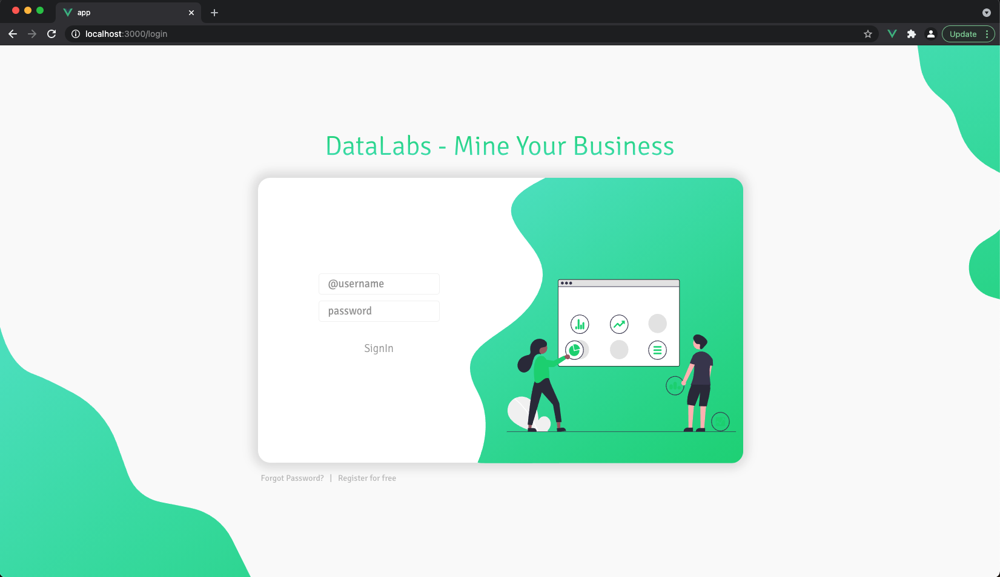
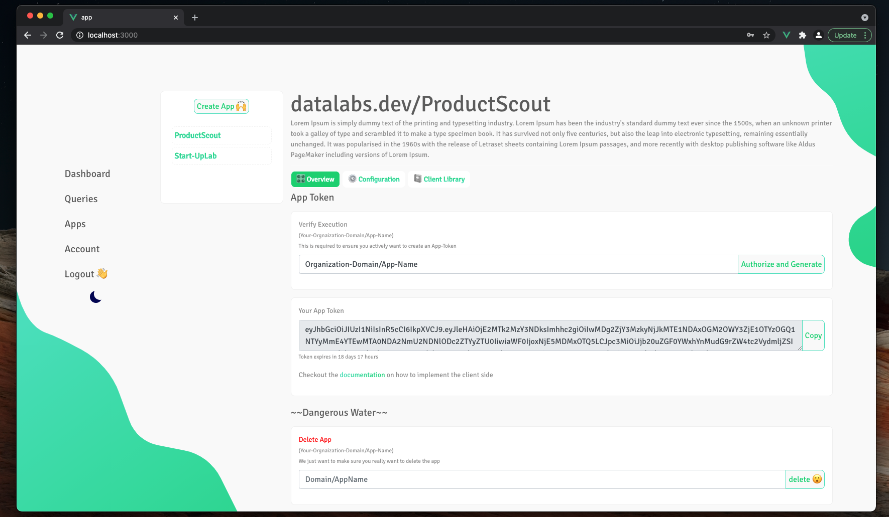

# datalabs analysis platform for user activity data

### Infrastructure cheat sheet

Services:
- APIGateway: :8080
- UserService: :8001
- TokenService: :8002
- AppService: :8003
(some say they can see a pattern not sure where..must change in future - ok for now)

Database server:
- UserService MongoDB: rasp-1:27017
- AppService MongoDB: rasp-1:27018

# Client Library: Data Flow
The idea of this `README` is to explain how the data collection on the client-side works. Further, the session and data life-cycle will be explained as well as the data format.

## Session Life-Cycle

STATE: INIT <br>
- call to `/api/hello` to indicate session start with following data:
``` json
{   
    "session_start": "UNIX time-stamp",
    "referrer": "page current page was called from",
    "browser": "Chrome",
    "OS": "MacOS",
}
```
- pass `cookie` if present else server sets new cookie
- call-back returns `web-socket ticket` to connect to socket
- attach `Event-Listener` to document

STATE: CONNECT <br>
- connect with Web-Socket

STATE: LISTEN <br>
- `listen for events` -> `process event` -> `send to web-socket` -> `start over`

STATE: CLOSING <br>
- graceful: send `goodbye` to server
- forceful: conn interrupt -> server terminates session

## Client data we get
- `referrer` | #1, #3
- `device info` | #4
- `click` of element | #2, #1
- `X,Y` of mouse-movement (needs more thinking - what to do with the data??)
- `elpased time` mouse hovered over specific element | #4
- `URL change` | #1, #2
- `time on URL` | #4

## What to visualize?
- `Customer Journey` [1]
- `Funnel (conversion rate)` [2]
- `Compaign Tracking` [3]
- `Audience Info` [4]


## Data by event

DATA: SESSION_RECORD<br>
```json
{
    "type": "start",
    "meta": {
        "device": {"os": "Macintosh", "browser": "Chrome"},
        "referrer": "https://www.google.com",
    }
}
```
EVENT: MOUSECLICK<br>
```json
{
    "type": 0,
    "timestamp" unix-timestamp,
    "event": {
        "X": pos-mouse-x,
        "Y": pos-mouse-y,
        "target": "css class | id | name"
    }
}
```
EVENT: URLCHANGE<br>
```json
{
    "type": 0,
    "timestamp" unix-timestamp,
    "event": {
        "elapsed" time-in-seconds,
        "next": "http://awesome.dev/next"
    }
}
```
EVENT: MOUSEHOVER<br>
```json
{
    "type": 0,
    "timestamp" unix-timestamp,
    "event": {
        "elapsed": duration of no-pos-change,
        "target": "css class | id | name"
    }
}
```
EVENT: MOUSEMOVE<br>
```json
{
    "type": 1,
    "timestamp" unix-timestamp,
    "event": {
        "X": pos-mouse-x,
        "Y": pos-mouse-y,
        "elapsed": duration of no-pos-change
    }
}
```
# So fare...
 



