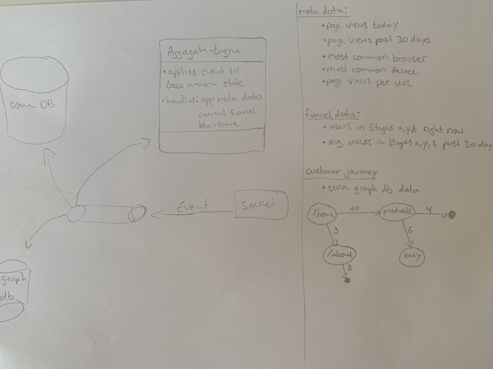

# datalab - mind your business

## Kontext und Idee 
`datalab` ist ein Plattform für Unternehmen, die mehr über Ihre User-Group erfahren wollen. Dabei erlaubt es die Plattform Daten, wie zum Beispiel 
`Conversion Rates`, `Customer Journeys`, zu tracken und als Informationen aufzubereiten. Nutzer können dabei sehr expliziert konfigurieren, wie der `Business Funnel` aus sieht und auch ganz speziell einzelne HTML-Elemente
tracken. Damit bietet `datalab` Unternehmen, neben den gängigen Metriken (`page views`, `views per route`, `most common browser`), konkrete Einblicke in die verschiedene `Stages` des definierten Funnels, detaillierte Informationen, wann und and 
welcher Stelle Kunden abspringen. 

Um `datalab` in Projekte zu integrieren, wird für jeder erstellte `App` ein unique Code-Snippet erstellt, welches auf der Client-Side injected werden kann (die dazugehörige `client library` wird bald via `node modules` und `npm` verfügbar sein)


## Manage Applications you want to monitor


## Customize what you want to monitor


## Work as a team


## Tech-Stack
- golang (für alle Micro-Services) https://golang.org
- gRPC für die interne Kommunikation der Services https://grpc.io
- gorilla-websocket https://github.com/gorilla/websocket
- MongoDB als Datenbank (eine Instance pro Service)
- Docker plus Docker-Swarm (perspektivisch Kubernetes) https://docs.docker.com/engine/swarm/
- Vue3 für das Frontend

## System Architecture
***behandelt nur die System Architecture der Plattform - NICHT die des Daten-Backendes***

FYI: Kafka is not yet implemented since Raspberry-Pi and its arch (`arm64`) does not support Kafka and Zookeeper on docker..however will be implemented ASAP once shifted to new hardware!!


## Service Responsibilities
Was die einzelnen Services machen, kann in deren `README` nachgelesen werden.
- [readme -> Service-Api-BFF](https://github.com/KonstantinGasser/datalab/tree/main/service.api.bff)

- [readme -> Service-User-Auth (not there yet...)](https://github.com/KonstantinGasser/datalab/tree/main/service.user.auth.agent)
- [readme -> Service-User-Meta (not there yet...)](https://github.com/KonstantinGasser/datalab/tree/main/service.user.meta.agent)

- [readme -> Service-App-Meta (not there yet...)](https://github.com/KonstantinGasser/datalab/tree/main/service.app.meta.agent)
- [readme -> Service-App-Config (not there yet...)](https://github.com/KonstantinGasser/datalab/tree/main/service.app.config.agent)
- [readme -> Service-App-Token (not there yet...)](https://github.com/KonstantinGasser/datalab/tree/main/service.app.token.agent)

- [readme -> Service-Notification-Live (not there yet...)](https://github.com/KonstantinGasser/datalab/tree/main/service.notification-live)
- [readme -> Service-Eventmanager-Live (not there yet...)](https://github.com/KonstantinGasser/datalab/tree/main/service.eventmananger.live)


## Information about what an ***App*** is
User geben bei der Registrierung ihre Organization an, zu welcher sie gehören (z.B. datalab.dev). Dies erlaubt die Interaktion mit anderen Kollegen mit der gleichen Organization-Domain (Cross-Organization matching is not supported - if you want it open an Issue:) or create a Pull-Request).

Auf der Platform kann jeder User **Apps** anlegen, die man Monitoren möchte und diese zielgerecht Konfigurieren. Damit andere auch mit wirken und Daten einsehen können, können Kollegen der gleichen Domain eingeladen werden. Um Daten zu generieren generiert man einen ***App-Token*** um Client-Devices zu authenticated and zu authorization. Zu gleich wird dem User beim Erstellen eines ***App-Token*** ein Code-Snippet beigefügt, welches in die Ziel Seite/Application eingebaut werden muss (entsprechende Installation Guides können der Dokumentation entnommen werden). Nach der Erstellung eines ***App-Token*** befindet sich die ***App*** in einem `locked state` und erlaubt keine weiteren Änderungen an den Konfigurationen mehr (das Entsperren von ***Apps*** ist ohne Probleme möglich, wobei die Partition mit den Daten archiviert wird (not yet implemented)).

Als Ersteller einen ***App*** ist auch nur dieser User Admin der ***App*** und hat volle rechte. Eingeladene Kollegen, können zwar Konfigurationen anpassen und ändern, jedoch keine ***App-Token*** erstellen, die ***App*** zurück in einen `unlocked state` setzen oder diese löschen. Selbes gilt auch für `public` ***Apps***, wobei hier keine Invites möglich sind, sondern jeder aus der Organization Zugriff auf die ***App*** hat (but not admin rights)


<!-- # Thoughts and Ideas

## Using Event Sourcing for Client-Events

Idea: each client event can be treated as a trigger for a state change - if a client clicks a button, the customer journey for `App` changes, the `Meta Data` for `btn-click-count` updates. Rather than just storing the data and
later on-demand perform complex and time-consuming queries, the event could not just be persisted by directly applied at an `aggregate`. Furthermore, this would allow doing more complex real-time computations while serving the data for the
dashboard from memory lighting fast. On a service, failure events could be loaded from the database into the `aggregate` recreating the last state of the system.


might have multiple `aggregates` depending on the context and domain - for simplicity, I will only use one to make my point.

`Aggregate A` is responsible for maintaining the state of the `page meta data` (page views today, last 30 days see figure). If an event occurs the event will be persisted but also consumed by the `aggregate`. Lets say the event triggered reflects a `URL-Change Event`, following the logic, the `aggregate` consumes the event and updates its local state for `page views per URL` and so on. 

Questions:

- Scalability of `aggregate service`: since the service must maintain the current state - horizontal scalability needs to be figured out. 
- does the `aggregate need to be aware of unique connections? Yes for internal logic. How to handle this in a performant fashion? -->


<!-- # datalab analysis platform for user activity data


# Client Library: Data Flow
The idea of this `README` is to explain how the data collection on the client-side works. Further, the session and data life-cycle will be explained as well as the data format.

## Session Life-Cycle

STATE: INIT <br>
- call to `/api/hello` to indicate session start with following data:
``` json
{   
    "session_start": "UNIX time-stamp",
    "referrer": "page current page was called from",
    "browser": "Chrome",
    "OS": "MacOS",
}
```
- pass `cookie` if present else server sets new cookie
- call-back returns `web-socket ticket` to connect to socket
- attach `Event-Listener` to document

STATE: CONNECT <br>
- connect with Web-Socket

STATE: LISTEN <br>
- `listen for events` -> `process event` -> `send to web-socket` -> `start over`

STATE: CLOSING <br>
- graceful: send `goodbye` to server
- forceful: conn interrupt -> server terminates session

## Client data we get
- `referrer` | #1, #3
- `device info` | #4
- `click` of element | #2, #1
- `X,Y` of mouse-movement (needs more thinking - what to do with the data??)
- `elpased time` mouse hovered over specific element | #4
- `URL change` | #1, #2
- `time on URL` | #4

## What to visualize?
- `Customer Journey` [1]
- `Funnel (conversion rate)` [2]
- `Compaign Tracking` [3]
- `Audience Info` [4]


## Data by event

DATA: SESSION_RECORD<br>
```json
{
    "type": "start",
    "meta": {
        "device": {"os": "Macintosh", "browser": "Chrome"},
        "referrer": "https://www.google.com",
    }
}
```
EVENT: MOUSECLICK<br>
```json
{
    "type": 0,
    "timestamp" unix-timestamp,
    "event": {
        "X": pos-mouse-x,
        "Y": pos-mouse-y,
        "target": "css class | id | name"
    }
}
```
EVENT: URLCHANGE<br>
```json
{
    "type": 0,
    "timestamp" unix-timestamp,
    "event": {
        "elapsed" time-in-seconds,
        "next": "http://awesome.dev/next"
    }
}
```
EVENT: MOUSEHOVER<br>
```json
{
    "type": 0,
    "timestamp" unix-timestamp,
    "event": {
        "elapsed": duration of no-pos-change,
        "target": "css class | id | name"
    }
}
```
EVENT: MOUSEMOVE<br>
```json
{
    "type": 1,
    "timestamp" unix-timestamp,
    "event": {
        "X": pos-mouse-x,
        "Y": pos-mouse-y,
        "elapsed": duration of no-pos-change
    }
}
```

## Docker-Swarm deployment
### CI/CD Pipe
<!-- The swarm lives on a Raspberry-PI4 (linux/arm64) consisting out of one node.
Each service (api,app,user,token,frontend) have their own `Makefile` with the `deploy` target. `make deploy` cross-compilies the executable for `linux/arm64` and builds a docker image also with cross-compilation for `linux/arm64`. Docker cross-compilation is achieved with the `docker buildx build` tool from docker which allows to build images on your local machine for a different OS/Arch. After the build `deploy` pushes the image to the `datalab-registry.dev:5000/<image-name>:<git-commit-hash>` which lives within the `swarm`. From their services can pull the latest images. -->

<!--

## Service - DNS Table (some say they can see a pattern..not sure where??)
| Service               | swarm-name                  | port in:out | credentials                |
|-----------------------|-----------------------------|-------------|----------------------------|
| gateway               | api-bff                     | 8080:8080   |                            |
| app                   | app-meta-agent              | 8003:8003   |                            |
| user                  | user-meta-agent             | 8001:8001   |                            |
| userauth              | user-auth-agent             | 8002:8002   |                            |
| config                | app-config-agent            | 8005:8005   |                            |
| apptoken              | app-token-agent             | 8006:8006   |                            |
| frontend              | frontend-web                | 80:80       |                            |
| mongo-app             | app-meta-agent-db           | 270121:27017 | app-meta-agent:secure     |
| monog-user            | user-meta-agent-db          | 27018:27017 | user-meta-agent:secure     |
| monog-config          | app-config-agent-db         | 27019:27017 | app-config-agent:secure    |
| monog-apptoken        | app-token-agent-db          | 27020:27017 | app-token-agent:secure     |
| monog-userauth        | user-auth-agent-db          | 27018:27017 | user-auth-agent:secure     |
| monog-notify          | notify-live-agent-db        | 27022:27017 | notify-live-agent:secure   |

-->

<!--
# So fare...


 -->
