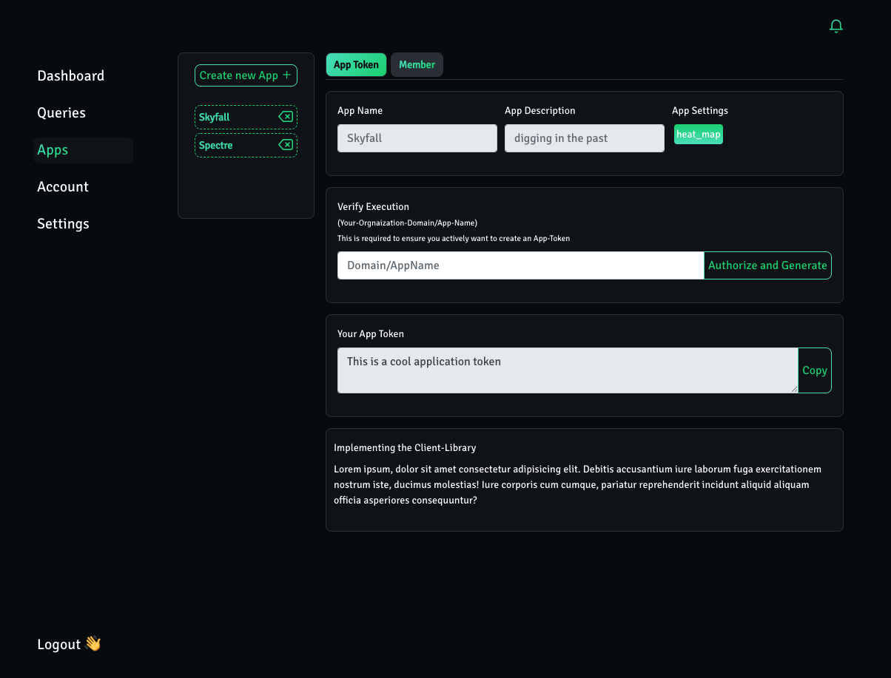
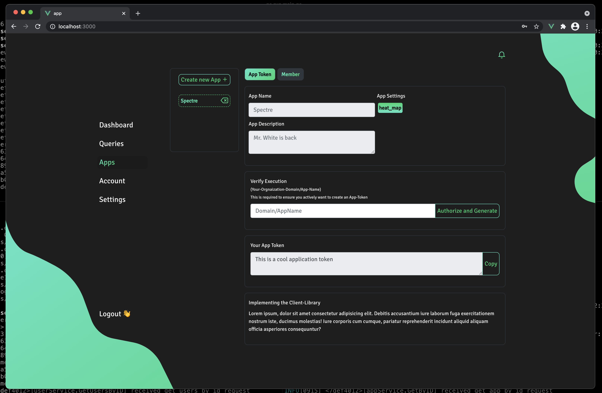

# Clickstream analysis platform for user activity data

### Infrastructure cheat sheet

Services:
- APIGateway: :8080
- UserService: :8001
- TokenService: :8002
- AppService: :8003
(some say they can see a pattern not sure where..must change in future - ok for now)

Database server:
- UserService MongoDB: rasp-1:27017
- AppService MongoDB: rasp-1:27018

# So fare...
 

