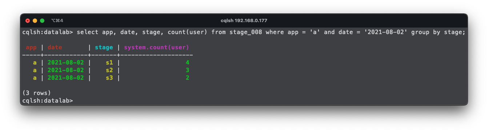
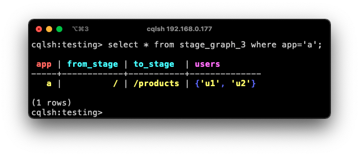
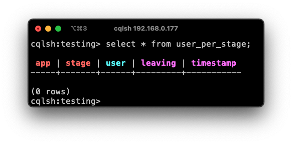
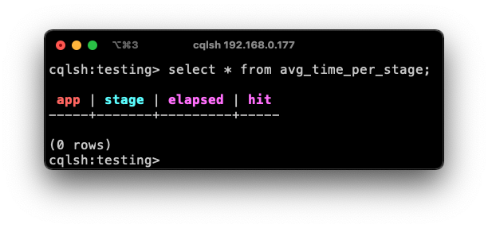
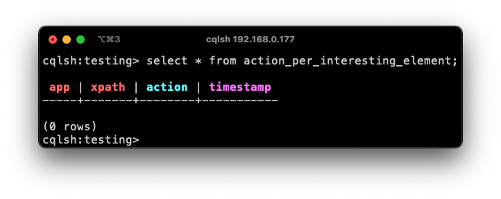
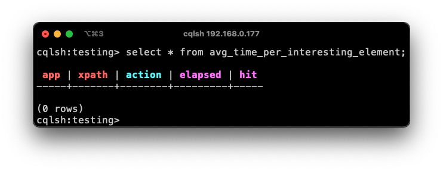
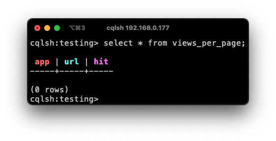
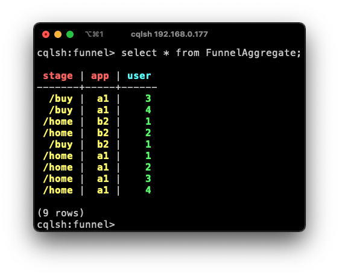
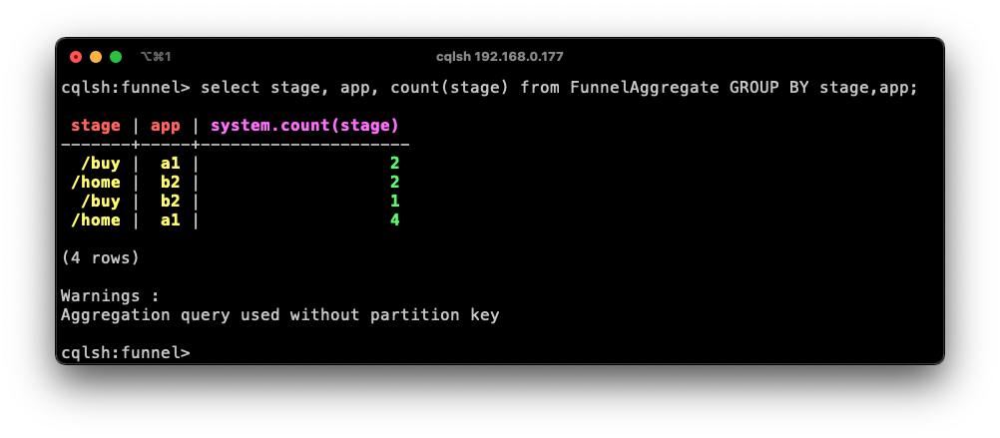
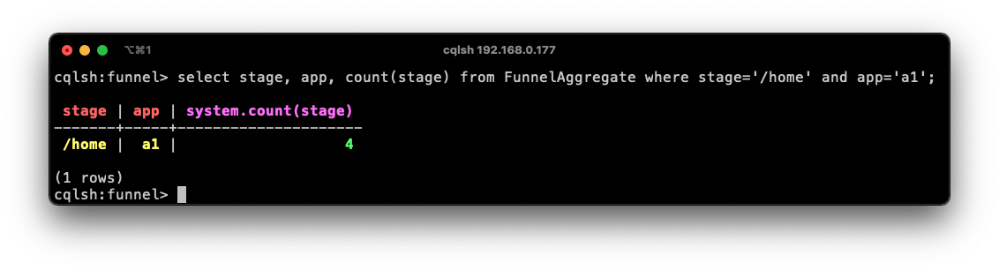

# service.eventmanager.live


# Database schema for MVP

## Find unique user per stage sortable by time

| app | date  | stage     | user |
|-----|-------|-----------|------|
| 007 | today | /home     | u1   |
| 007 | today | /home     | u2   |
| 007 | today | /products | u1   |

For this table the `partition key is: app`. The `date, stage` and `user` fields serve as `clustering key`. 
With the keys set like so one can use the following query to retrieve the information of unique users per stage: `select app, date, stage, count(user) from table where app = '007' and date = 'today' group by date, stage;`. Since the `partition keys` are referenced in the query, the group by and the count will still be performant.



## Find avg time users spend per stage

| app | stage     | elapsed | hit |
|-----|-----------|---------|-----|
| 007 | /home     | 24      | 4   |
| 007 | /products | 12      | 2   |

Here the `app` serves as the `partition key` (data will not be well balanced, in prod might need to use some hash along the `app` to distribute the data evenly). `stage` is the `clustering key` and both `elapsed` and `hit` are `Cassandra counter types`. To query the data: `select * from table where app = '007' and stage = '/home';`. Finally, divide `elapsed` by `hit` to get the avg time. (elapsed is in seconds)


## Find total hits per action for an interesting button

| app | xpath          | hover_leave | elapsed_leave | hover_click | elapsed_click | hit |
|-----|----------------|-------------|---------------|-------------|---------------|-----|
| 007 | div/button     | 16          | 24            | 4           | 10            | 20  |
| 007 | div/div/button | 12          | 5             | 2           | 4             | 14  |

`partition key` is the `app uuid` (might need an extra field to be better distributed across a cluster but YOLO for now). `xapth` forms the `clustering key`. `hover/elapsed_leave, hover/elapsed_click, hit` are all `counter types`

Query would simply query for one app/xpath and compute the percents of both actions


<!-- ## Queries for ***funnel data***

### using cassandra as graph database


1. `partition key`: app, stage -> the app-uuid and the unique stage name form the partition key.
2. `clustering key`: from_stage, to_stage 

(app, stage, date,), user -> count of rows is number of unique users in stage at date x

By using this table schema we are able to represent any funnel action performed by users as a graph. Where each row represents an edge from A -> B with a given weight (weight is the length of the users set (a set in Cassandra is a list of unique elements)).
Hence, to get a detailed view on how users jump from stage to stage a simple query like this one `SELECT * from stage_graph_3 where app = 'uuid';`
would return all hit edges (A->B) and its weights.
 
### Unique users per stage
As a first table, we have the information about how many unique users entered the given stages from a funnel definition.


1. `partition key`: app, stage -> the app-uuid and the unique stage name form the partition key.
2. `clustering key`: user -> to only insert a unique user who has not yet entered the stage, the use-uuid (IP) is used as a clustering key.
 
### Average time per stage
To compute the average time users spend on a given stage, the following table utilizes Cassandras `counter data type` for direct aggregations.


1. `partition key`: app
2. `clustering key`: stage 

By increasing the `elapsed` time captured in a `FunnelChangeEvent` and increasing the `hit` by one, we can later query for a stage and divide the `elapsed time` by the `hit` count to get the `avg. time` for a stage


### Actions performed on interesting elements
If configured an `App` can have multiple `interesting elements`. On this element two actions can happen. Firstly, `hover-then-leave` which indicates, that the element was hovered on for a certain time and then left. Secondly, `hover-then-click` which indicated, that after a certain time the element was hovered on it also was clicked. Interesting is the percentage of the `actions` in combination with the `avg. time`.



1. `partition key`: app, xpath (of the HTML-Element)
2. `clustering key`: action -> to get the unique count of actions

As for the `elapsed time` we require another table using the Cassandra `counter type` again.



1. `partition key`: app, xpath
2. `clustering key`: action 

This allows us to get two values per element. One for the `hover-then-leave` action and one for the `hover-then-click` action.

By increasing the `elapsed` time captured in an `InterestingElementEvent` and increasing the `hit` by one, we can later query for an `element` and divide the `elapsed time` by the `hit` count to get the `avg. time` for a stage

### Example for the meta data
There will be more tables taking care of meta data such as `most common (browser, OS, device)`. However, I will only cover `views per page` as of now until the main data schema has been implemented.



1. `partition key`: app
2. `clustering key`: url

Using a Cassandra `counter` for the `hits` of an URL will be relatively straight forward and therefore does not need further explanations


# Query Driven Design
The objective for this section is to get a better understanding of the queries we need. The queries are only concerning the `platform dashboard` showing the collected user data.

## 1. Funnel Data
### 1.1 Conversion Rate
The conversion rate is calculated as followed: `distinct user count per stage` divided by `count of all users (in a time-frame)`.
Here-fore, the total count for users from one `App` must be queried as well as each stage in its distinct user count.

## 2. "interesting buttons"
`interesting buttons` are specific `HTML-Elements` that get tracked. About the elements, we know how long a user hovered over the element and then either clicked or left the element. Therefore, we have to interesting pieces of data; 1) the duration the user spent on the element, 2) the action performed on the element (`clicked` or `left`)
### 2.1 Average duration on the element
to compute the average duration spent on the element, the data needs to be aggregated. 
### 2.2 Percentage of both actions
select all actions of both types plus the total count of actions. Divide `type` by `total`.

### 2.3 Correlation between duration and action
would be cool - however, not my concern rn

## 3. Meta data aggregation
### 3.1 Most common device, 3.2 Most common browser
select the distinct total count of users and divide the count `type` by `total user count`

### 3.3 Views per page
here a `Cassandra counter` could be used for each `page`, which gets increased each time a page hit happens.

## 4. Customer Journey
well good question...

<!-- # Data modeling for Funnel Aggregation with Cassandra (testing out things)
A `funnel` can consist out of `N` stages, where each `stage` represents one state in the `funnel`. 
The objective is to understand how many users (unique users) are in each `stage`.

## Approach #1
For the first approach, I am using a simple data schema where all extra meta-data (for the column family) has been ignored
but only focuses on the `partition key` and `clustering key`. 

### ***Table Schema***


Here the `partition key` is defined by the `stage-name`. The `clustering key` is defined by users ***UUID***.
This allows to `insert` users entering a given `stage` in a distinct way. Hence, a user will not be two times in the same `stage`.

### ***Query: get distinct count for stage X***


The result of this query shows that in `stage == "/home"` are three distinct users.

### ***Query: get distinct count for all stages with GROUP BY***


With this query all `stages` and their `distinct count` can be queried. However, as stated by the console output (`"Aggregation query used without partition key"`) we get an indication that the query might not perform good at scale


### Challenges 
Even though this example represents a use-case from the problem statement, it ignores some relevant points. Firstly, the table will hold more than one `funnel definition` either from different `Apps` of the same organization or `Apps` from other organizations. However, by using the `stage` and `app-uuid` as `partition key` the query can still be efficient


## Approach #2
With this approach, the objective is to account for different funnels in the same table (as mentioned in the [challenges-approach-1](###Challenges))

### ***Table Schema***



To address the issue of multiple funnels in the same table, this approach uses a combination of the `stage` and `app reference` for the `partition key` (the `clustering key` stays the same)

### ***Query get distinct count for all stages with GROUP BY***



This does not differ from the ***query from approach #1*** in terms of performance issues.

### ***Query distinct count per partition key(stage,app)***


With this query we would need to perform `N` queries for each stage of an application - however since it is using the `partition key` as part of the query it will be more performant then using the `GROUP BY` option -->


# Event Definitions
### Raw-Event: Click
```json
{   
    "type": "int", // indicates what type of event
    "timestamp": "int64", 
    "device_id": "string", // most likly the devices IP address
    "target": "string", // clicked HTML element - if given HTML-Name-Tag else whatever if find lol
    "elapsed_time": "int64", // passed time since last click
    "current_url": "string" // URL clicked happened
}
```
### Raw-Event: URL-Change
```json
{   
    "type": "int", // indicates what type of event
    "timestamp": "int64", 
    "device_id": "string", // most likly the devices IP address
    "from": "string", // URL jumped from
    "to": "string", // URL jumped to
    "elapsed_time": "int64", // passed time on "from" URL
}
```

### Config-Based-Event: BTN-Time
```json 
{   
    "type": "int", // see above
    "timestamp": "int64", 
    "device_id": "string", // see above
    "target": "string", // HTML element triggered by
    "action": "string", // can be hover-then-leave or hover-then-clicked
    "elapsed_time": "int64", // passed time from click to action
}
```

### Config-Based-Event: Funnel-Change (onClick / URL-Change if part of funnel config)
```json 
{
    "type": "int", // see above
    "timestamp": "int64", 
    "device_id": "string", // see above
    "action": "string", // onClick || onUrlChange
    "entered": "int", // stage id
    "elapsed_time": "int64" 
}
```
